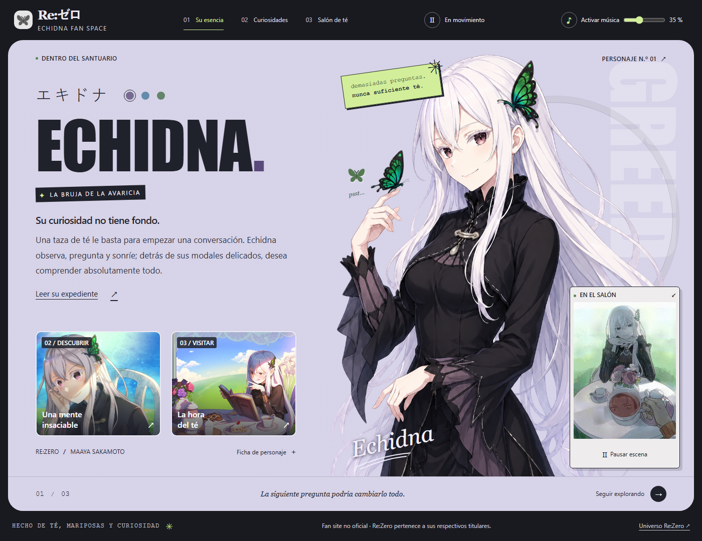

# Echidna · Un té en el Santuario

Un fan site de una sola página dedicado a Echidna, la Bruja de la Avaricia de **Re:Zero**. Un pequeño santuario interactivo con curiosidades del personaje, mariposas, música y una conversación que continúa taza a taza.



## Dentro del santuario

- Tres capítulos: **Su esencia**, **Curiosidades** y **Salón de té**.
- Juego con **99 reacciones originales**: después de la taza 99, el contador vuelve a 0 y comienza otra ronda.
- Ambientes lavanda, azul hielo y menta; la selección se conserva entre visitas.
- Música en bucle con silencio, volumen y preferencias guardadas.
- Escena animada, mariposa interactiva y movimiento sutil del personaje.
- Expediente del personaje con controles de cierre, clic exterior y tecla Escape.
- Diseño responsive, navegación por teclado y respeto por la preferencia de movimiento reducido.
- Metadatos básicos para buscadores y redes sociales, e icono SVG propio.

La música intenta comenzar al entrar. Si el navegador bloquea el sonido automático, arranca con la primera interacción o con el botón de música. La escena animada utiliza un video WebM sin sonido generado a partir del GIF original; inicia automáticamente salvo que esté activada la preferencia de movimiento reducido.

## Ejecutar el proyecto

Se necesita **Node.js 22.12 o superior** y npm. El proyecto se ha comprobado con Node.js 24.15.0.

Desde la raíz del repositorio:

```bash
cd ElblogdeEchidna
npm ci
npm run dev
```

Abre [http://127.0.0.1:5173](http://127.0.0.1:5173). No hacen falta claves API, cuentas ni variables de entorno.

| Comando | Función |
| --- | --- |
| `npm run dev` | Inicia Vite en el puerto 5173. |
| `npm run build` | Genera la web de producción en `ElblogdeEchidna/dist/`. |
| `npm run preview` | Permite revisar localmente la compilación. |
| `npm test` | Ejecuta las pruebas de Playwright. |
| `npx playwright test` | Ejecuta la misma suite directamente. |
| `npm audit` | Consulta vulnerabilidades conocidas de las dependencias. |

Todos los comandos de la tabla se ejecutan dentro de `ElblogdeEchidna/`.

## Pruebas

Si Chromium todavía no está instalado para Playwright, prepáralo una vez:

```bash
npx playwright install chromium
```

Después:

```bash
npm run build
npx playwright test
```

La suite contiene **16 pruebas**:

- 9 comprobaciones responsive a 375, 767, 768, 1023, 1024, 1199, 1200, 1399 y 1400 px.
- 7 comprobaciones de navegación, diálogo, 99 reacciones y reinicio, temas, mariposa, audio, animación, movimiento reducido y carga de recursos.

Playwright inicia el servidor configurado en `127.0.0.1:5173` o reutiliza uno existente. Los resultados, capturas de fallos y trazas se generan en `test-results/` y quedan fuera de Git.

## Estructura

```text
El-Blog-Echidna/
├── ElblogdeEchidna/
│   ├── index.html
│   ├── public/
│   │   └── echidna-icon.svg
│   ├── src/
│   │   ├── assets/
│   │   │   ├── audio/music-loop.mp3
│   │   │   ├── gifs/echidna-tea-source.gif
│   │   │   ├── images/
│   │   │   └── videos/tea-loop.webm
│   │   ├── js/main.js
│   │   └── scss/
│   │       ├── base/
│   │       └── style.scss
│   ├── tests/
│   │   ├── interactions.spec.js
│   │   └── responsive.spec.js
│   ├── package.json
│   ├── package-lock.json
│   ├── playwright.config.js
│   └── vite.config.js
├── media/
│   ├── echidna-desktop.png
│   ├── echidna-mobile.png
│   └── echidna-tablet.png
├── .gitignore
├── LICENSE
└── README.md
```

HTML, JavaScript nativo y SCSS componen la interfaz; Vite se encarga del desarrollo y la compilación. No hay dependencias de ejecución externas. Los temas y ajustes de audio se guardan en `localStorage`; el contador del té empieza de nuevo al recargar.

## Recursos y publicación

Los recursos tienen nombres descriptivos: `echidna-portrait.webp`, `echidna-tea-garden.webp`, `echidna-expressions.webp` y `echidna-character.png`. El GIF original se conserva para poder regenerar el WebM, pero no se descarga al visitar la web. El póster de la animación está en `src/assets/images/tea-poster.webp`.

El archivo `echidna-character.prompt.txt` documenta la creación asistida por IA de la ilustración principal. Las capturas de este README se guardan exclusivamente en `media/`.

El repositorio incluye el archivo de bloqueo de npm. `.gitignore` excluye dependencias instaladas, compilaciones, resultados de pruebas, archivos temporales, configuración local y patrones habituales de credenciales. No se deben guardar secretos en el HTML, JavaScript ni recursos públicos: el navegador puede leerlos.

Para alojar la web, utiliza el contenido de `ElblogdeEchidna/dist/` después de compilar. Si el alojamiento sirve desde un subdirectorio, configura la ruta base de Vite para ese destino. Los metadatos sociales deben revisarse con la URL pública definitiva.

## Créditos

Fan site no oficial creado por **Koridormi**. Re:Zero y Echidna pertenecen a sus respectivos titulares. El perfil enlaza las fuentes oficiales del personaje; las respuestas del juego de té son textos originales del sitio.

El código del proyecto se distribuye bajo la [licencia MIT](LICENSE). Los recursos multimedia de terceros no se relicencian como MIT. Normalize.css conserva su aviso de licencia en el archivo fuente.