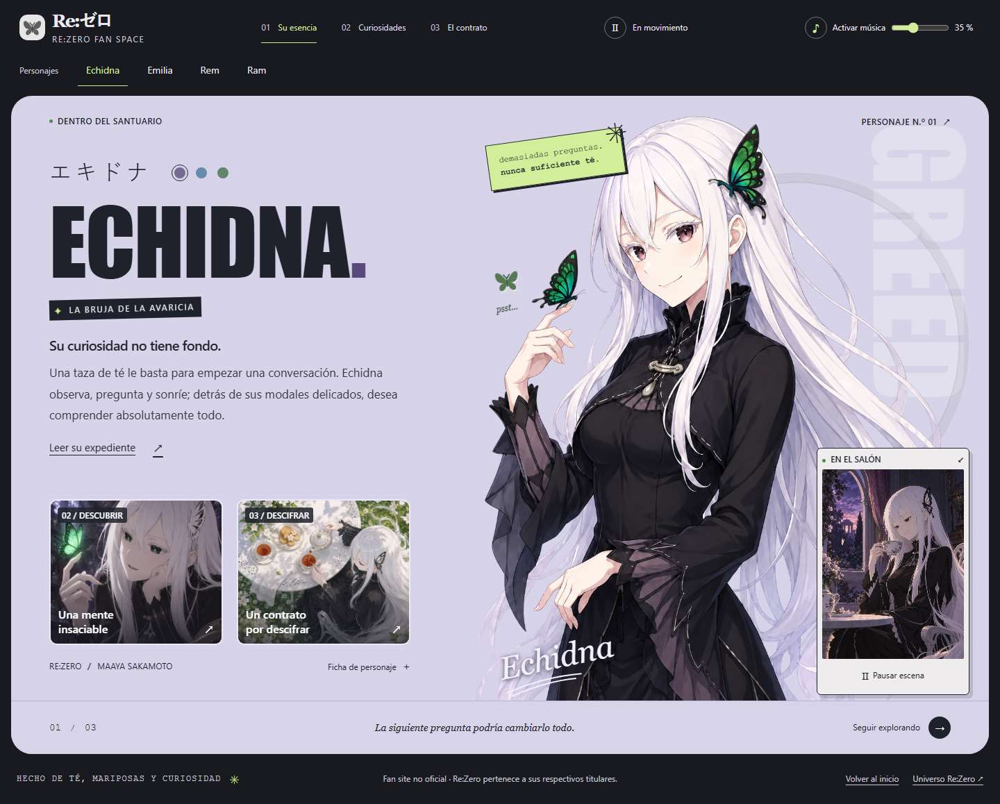

# Re:Zero Fan Space

Fan site de **Echidna, Emilia, Rem y Ram**, construido con HTML, JavaScript nativo, SCSS y Vite. Echidna es la página de inicio; los enlaces entre personajes funcionan también sin JavaScript.



## Explorar y jugar

Cada perfil comparte tres capítulos, seis curiosidades, un expediente ilustrado, temas de color y controles de movimiento y música.

| Personaje | Juego |
| --- | --- |
| Echidna | **El contrato de las tres runas**: deduce un orden secreto con pistas y hasta seis hipótesis. |
| Emilia | **La memoria del hielo**: encuentra cuatro parejas en un tablero que cambia en cada partida. |
| Rem | **La cocina de los pedidos**: prepara tres recetas distintas, ordena los ingredientes y corrige las bandejas. |
| Ram | **El acertijo del viento**: despeja tres senderos con ráfagas en cruz y opción de deshacer. |

Los juegos no tienen límite de tiempo y permiten reiniciar. Sus reglas y mensajes son creaciones del fan site, no contenido canónico del anime.

La música requiere una primera activación explícita. Después conserva activación, silencio y volumen entre personajes y pestañas; recupera la posición al navegar en la misma pestaña. Si el navegador bloquea la reanudación, el botón permite iniciarla de nuevo. Los temas y el audio utilizan `localStorage`; la posición del audio utiliza `sessionStorage`.

Los cuatro personajes tienen escenas animadas sin sonido. Se reproducen automáticamente salvo con movimiento reducido y pueden pausarse o reanudarse desde la página. Los GIF están en `media/animations/`; la web sirve versiones WebM de 806 × 1080 con póster WebP para reducir el peso y controlar la reproducción.

- [Echidna: té al atardecer, mariposa y jardín](media/animations/echidna-scene.gif).
- [Emilia: cristales y nieve](media/animations/emilia-scene.gif).
- [Rem: parpadeo, cintas y fuego de la cocina](media/animations/rem-scene.gif).
- [Ram: viento y hojas](media/animations/ram-scene.gif).

Echidna y Emilia tienen ilustraciones creadas para sus escenas; Rem y Ram reutilizan sus ilustraciones de cocina y jardín con animaciones propias. El video anterior de Echidna se sustituyó por la escena nueva.

[Ver el juego de Echidna en móvil](media/echidna-contract-mobile.png)

## Desarrollo

Se recomienda **Node.js 22.12 o posterior**. Desde la raíz del repositorio:

```bash
cd ElblogdeEchidna
npm ci
npm run dev
```

Abre [http://127.0.0.1:5173](http://127.0.0.1:5173). No se necesitan claves API ni cuentas.

| Comando | Resultado |
| --- | --- |
| `npm run dev` | Servidor local en el puerto 5173. |
| `npm run build` | Compila las cuatro páginas en `dist/`. |
| `npm run preview` | Sirve la compilación en local. |
| `npx playwright test` | Ejecuta la suite completa. |
| `npx playwright test --workers=1` | Ejecuta las mismas pruebas en serie para equipos con recursos limitados. |

Si falta el navegador de pruebas, se instala con `npx playwright install chromium`. Todos estos comandos se ejecutan desde `ElblogdeEchidna/`.

## Validación y accesibilidad

Las **39 pruebas** cubren juegos, victoria y reinicio, curiosidades, navegación, estructura de expedientes, metadatos, carga de recursos, audio, animación y teclado. Se comprueban 375, 767, 768, 1023, 1024, 1199, 1200, 1399 y 1400 px.

La interfaz incluye enlace para saltar al contenido, controles etiquetados, foco visible, mensajes de juego anunciados, imágenes con alternativas textuales, cierre de expedientes con Escape y respeto por movimiento reducido. Estas comprobaciones son una revisión básica, no una certificación completa de accesibilidad.

Playwright inicia o reutiliza el servidor de `playwright.config.js`. Capturas de fallos y trazas quedan en `test-results/`, fuera de Git.

## Estructura

```text
ElblogdeEchidna/
├── index.html
├── pages/characters/          # Emilia, Rem y Ram
├── public/echidna-icon.svg
├── src/
│   ├── assets/
│   │   ├── audio/            # Música compartida
│   │   ├── images/           # Echidna y póster de su escena nueva
│   │   ├── characters/       # Ilustraciones por personaje
│   │   └── videos/           # Escena WebM de Echidna
│   ├── js/
│   │   ├── main.js           # Interacciones de Echidna
│   │   ├── music.js          # Preferencias y reproducción compartidas
│   │   └── characters/      # Perfiles y juegos
│   └── scss/                # Plantilla común y ajustes de personajes
└── tests/
media/                       # Capturas y GIF de referencia, en la raíz del repo
```

Los retratos `*-character.webp` conservan transparencia; `*-curiosities-card.webp`, `*-game-card.webp`, `echidna-contract-card.webp` y `*-dossier-scene.webp` tienen fondos ilustrados. Los prompts de generación se guardan junto a las imágenes creadas. Las fuentes y scripts de animación quedan en `profiles/`, carpeta local ignorada por Git; los WebM, pósteres y GIF necesarios para la web y este README sí se conservan en el repositorio.

## SEO y publicación

Las páginas incluyen títulos y descripciones propios, metadatos Open Graph y Twitter, idioma español y datos estructurados `WebPage`. Las imágenes sociales apuntan a recursos incluidos en la compilación.

Para publicar, ejecuta `npm ci` y `npm run build` dentro de `ElblogdeEchidna/`, y sirve el contenido completo de `ElblogdeEchidna/dist/` como sitio estático. El alojamiento debe permitir acceso directo a `/`, `/pages/characters/emilia.html`, `/pages/characters/rem.html` y `/pages/characters/ram.html`, además de los archivos en `assets/`. Comprueba estas cuatro rutas una vez desplegadas. Si el alojamiento usa un subdirectorio, ajusta la base de Vite para ese destino antes de compilar.

Antes de publicar con un dominio definitivo, añade las URL canónicas, `og:url` y las URL absolutas de imágenes sociales; entonces podrá generarse el sitemap. No se incluye un dominio ficticio. La compilación y las rutas locales se pueden validar sin esas URL, pero las vistas previas sociales y la indexación final requieren el dominio real.

`.gitignore` excluye dependencias, compilaciones, resultados de pruebas y archivos locales o de credenciales. Todo recurso servido por el navegador es público.

## Créditos

Fan site no oficial de **Koridormi**. Las fichas enlazan fuentes oficiales del [anime](https://re-zero-anime.jp/tv/character/) y la [novela](https://re-zero.com/). Las ilustraciones generadas con IA son interpretaciones artísticas, no fotogramas oficiales.

Re:Zero y sus personajes pertenecen a sus respectivos titulares. El código se distribuye bajo la [licencia MIT](LICENSE); los recursos multimedia de terceros no se relicencian como MIT. Normalize.css conserva su aviso de licencia.
